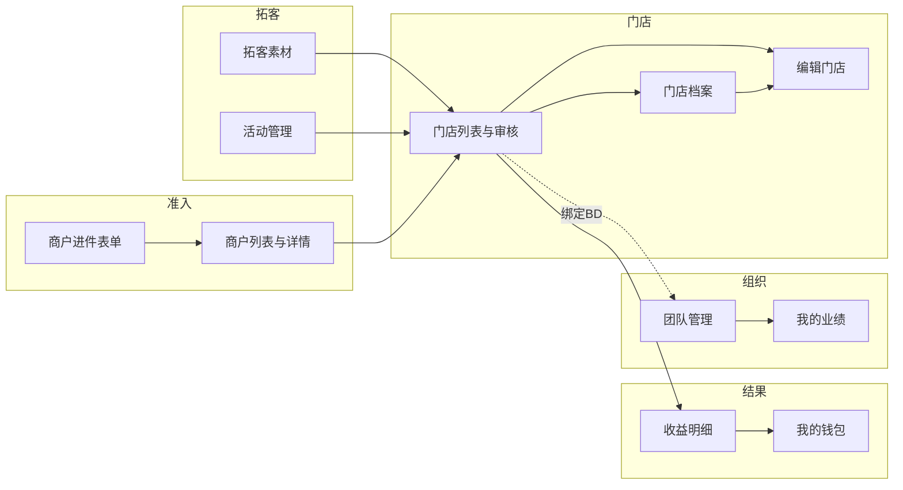

# 产品需求文档（PRD）— B 端 BD 工作台

| 文档信息 | 内容 |
|---------|------|
| 产品名称 | B 端 BD 工作台（移动端 Web） |
| 工程路径 | `B端BD/--main` |
| 技术栈 | React 18、TypeScript、Vite、React Router v6、TanStack Query、Tailwind、shadcn/ui |
| 版本 | V1.1 |
| 原型对照 | 以 `src/pages/*.tsx` 与 `src/data/mockData.ts` 当前实现为「界面与字段真值」；对接期替换为真实接口 |

---

## 1. 产品概述

### 1.1 定位

面向 **BD（业务发展）** 的 **H5 / 移动 Web** 工作台：门店线索与审核、商户进件、收益查看、团队与业绩、个人中心与钱包等。当前列表与详情数据主要来自 **前端 Mock**，上线前需对接后端 API 并同步字段类型。

### 1.2 典型用户

- 一线 BD、高级 BD、区域经理等（权限与数据范围由后端账号体系决定，本 PRD 在「枚举/边界」中预留说明位）。

### 1.3 范围边界

- 本文档描述 **本仓库内已实现或可识别的页面与控件**；未展开页面的细节以路由索引 **§2** 为准，可在迭代中按 **主表七列** 结构增补；业务与联动说明按 **§1.5～§1.8**、**§N.0**、**附录 A** 同步维护。
- **不与**其它产品线的 PRD 强制交叉引用；若需统一登录或商户主数据，在接口层约定即可。

### 1.4 表头列说明（主表 · 七列表）

主文各页 **字段/控件级** 表采用下列 **7** 列；**业务含义与跨模块联动**在 **§1.5～§1.8** 与各章 **§N.0**、**附录 A** 展开，避免与主表重复堆砌。

| 列名 | 含义 |
|------|------|
| **功能类型** | 界面控件角色 + **字段/数据类型**（如 `string`、`int`、`decimal`、`datetime`、必填/只读等） |
| **功能描述** | **在界面与交互层面**：用户操作后发生什么、系统如何响应；并含 **字段类型说明**（格式、读写、与接口字段关系） |
| **文案说明** | 标签/占位/提示语义（无则「—」） |
| **关联** | 路由、接口字段、Mock 类型、权限点 |
| **枚举/边界** | 合法取值、长度、状态、校验 |

### 1.4.1 扩展列定义（附录 A · 十列表）

附录 **「附录 A：业务描述与联动字典」** 在七列基础上增加三列，专写 **Why（业务）** 与 **Who/Where（联动）**：

| 列名 | 含义 |
|------|------|
| **业务描述** | **在业务层面**：该能力解决什么问题、处于哪条业务流程哪一步、业务规则要点（非界面操作细节） |
| **业务联动** | **业务对象/域之间**：与哪些实体（门店、商户、订单、收益、团队、账号）发生数据或状态上的依赖、回写、汇总关系 |
| **功能联动** | **页面/操作之间**：从哪进入、跳转到哪、是否刷新列表、是否依赖弹窗/异步结果、与消息/钱包等模块的触发关系 |

> **同一页不去重：** 筛选/Tab 与列表若表达同一业务字段，**各自模块单独占行**描述；`关联` 可互指，但不省略任一侧行。

---

### 1.5 业务价值链（业务描述总览）

BD 工作台承载的业务闭环可概括为：

1. **拓客与签约前**：素材（`/materials`）、活动（`/activities`）、AI（`/ai`）等支持触达与说明。  
2. **主体准入**：**商户进件**（`/merchants`、`/merchants/onboarding`）完成支付主体/资质进渠道；通过后产生 **商户主数据** 与 **门店/经营单元** 的关联基础。  
3. **门店落地**：**门店管理**（`/leads`）维护门店档案、审核状态、配送与 BD 绑定；**审核资料**（`/leads/:id`）与 **门店档案/工作台**（`/leads/:id/workspace`）与 **编辑**（`/leads/:id/edit`）形成「录入 → 审核 → 经营」闭环。  
4. **结果兑现**：门店产生交易后，**收益明细**（`/revenue`）按门店/时间维度展示分佣；**我的钱包**（`/wallet`）等与结算到账、提现联动（具体规则以后端结算域为准）。  
5. **组织管理**：**团队管理**（`/team`）管理下级 BD 与业绩；**我的业绩**（`/profile/performance`）与团队报表形成个人↔团队双视角。  
6. **账户与安全**：**我的**（`/profile`）聚合入口；实名、银行卡、安全设置是 **收益提现** 的前置条件。

**业务边界说明：** 本应用侧重 **BD 作业与信息展示**；支付清算、分账规则引擎等在 **后台/结算服务** 完成，前端展示字段需与接口契约一致。

---

### 1.6 业务联动矩阵（业务域之间）

| 业务域 A | 业务域 B | 联动关系说明 |
|----------|----------|----------------|
| 商户进件 | 门店管理 | 进件成功后的商户/门店主数据为门店列表、门店卡片字段（如编号、绑定关系）提供基础；驳回/审核中影响门店侧是否可展业（规则由后台定） |
| 门店管理 | 收益明细 | 收益按「门店/商户名称」维度汇总；门店无效或解绑后历史收益是否仍展示由结算与数据归档策略决定 |
| 门店管理 | 团队管理 | 卡片「绑定 BD」与团队成员归属一致；团队业绩中的「发展商户/门店数」应对齐同一统计口径 |
| 收益明细 | 我的钱包 | 分佣收益入账后影响钱包余额与流水；提现依赖银行卡与实名状态 |
| 消息通知 | 商户/门店 | 审核结果、进件结果等可推送消息；点击消息可深链到对应详情页（若产品启用） |
| 首页指标 | 门店/收益 | 「已发展门店」「本月新增」「今日收益」应对齐 `/leads`、`/revenue` 同源统计接口，避免三套数 |
| 实名/银行卡 | 提现 | 未完成实名或未绑卡时，提现入口应禁用或引导至 `/profile/verification`、`/profile/bank-cards` |

---

### 1.7 功能联动矩阵（页面与操作级）

| 功能点 | 所在页面/路由 | 触发条件 | 联动行为（下游） |
|--------|----------------|----------|------------------|
| 工作台宫格「门店管理」 | `/` | 点击 | `navigate('/leads')` |
| 工作台宫格「商户进件」 | `/` | 点击 | `navigate('/merchants')` |
| 门店卡片整体点击 | `/leads` | 点击卡片 | `navigate('/leads/:id/workspace')` 进入档案 |
| 审核资料 | `/leads` | `phase === awaiting_bd` 且点击按钮 | `navigate('/leads/:id')`，阻止冒泡 |
| 添加门店 | `/leads` | 点击 FAB | `navigate('/leads/new/edit')` |
| 商户卡片 | `/merchants` | 点击 | `navigate('/merchants/:id')` |
| 商户进件 FAB | `/merchants` | 点击 | `navigate('/merchants/onboarding')` |
| 收益门店筛选 | `/revenue` | 变更下拉 | 重算 `filteredList` 与汇总区 |
| 收益日/月/累计 | `/revenue` | 切换分段 | 变更分组标题与汇总维度展示 |
| 团队查看业绩 | `/team` | 点击成员 | 打开业绩 Dialog，数据来自该成员 `performance` |
| 我的钱包入口 | `/profile` | 点击 | `navigate('/wallet')` |
| 底部 Tab | 首页/AI/我的 | 切换 | 切换 `/`、`/ai`、`/profile`，保持 SPA 路由栈 |

---

### 1.8 端到端链路示意（业务 × 功能）

---

## 2. 信息架构与路由索引

| 路径 | 页面标题（PageHeader/逻辑标题） | 主要职责 |
|------|--------------------------------|----------|
| `/` | （首页） | 工作台入口、数据概览、消息摘要、营销素材入口 |
| `/revenue` | 收益明细 | 门店维度 + 日/月/累计 + 分佣收益列表 |
| `/team` | 团队管理 | 团队概览、成员列表、添加/编辑/移除、业绩弹窗、业绩报表 |
| `/leads` | 门店管理 | 搜索、状态 Tab、门店卡片列表、添加门店 |
| `/leads/:id` | 审核资料 | 单店审核详情（依 `StoreDetailPage`） |
| `/leads/:id/edit` | 添加门店 / 编辑门店 | 门店资料表单（含 `new` 创建） |
| `/leads/:id/workspace` | 门店档案 | 门店工作台/档案 |
| `/reports` | 数据报表 | 数据看板 |
| `/activities` | 活动管理 | 活动列表/运营 |
| `/guide` | 操作指南 | 帮助文档 |
| `/support` | 联系客服 | 客服入口 |
| `/ai` | AI | AI 能力页 |
| `/profile` | 我的 | 个人信息、钱包入口、分组菜单 |
| `/messages` | 消息通知 | 消息列表 |
| `/messages/:id` | 消息详情 | 单条消息 |
| `/materials` | 拓客素材 | 素材列表 |
| `/materials/:id` | 素材详情 | 单条素材 |
| `/wallet` | 我的钱包 | 余额与流水入口 |
| `/wallet/withdraw` | 提现 | 提现流程 |
| `/wallet/detail/:id` | 交易详情 | 单笔流水详情 |
| `/profile/merchants` | 我的商户 | 与我关联的商户 |
| `/merchants` | 商户进件 | 搜索、Tab、商户卡片、进件 FAB |
| `/merchants/onboarding` | 商户进件 | 进件表单流程 |
| `/merchants/:id` | 商户详情 | 进件资料只读/详情 |
| `/profile/performance` | 我的业绩 | 个人业绩 |
| `/profile/invite` | 邀请好友 | 邀请拉新 |
| `/profile/bank-cards` | 我的银行卡 | 结算卡管理 |
| `/profile/verification` | 实名认证 | 实名流程 |
| `/profile/security` | 账号安全 | 安全设置 |
| `/profile/notifications-settings` | 消息设置 | 通知开关 |
| `/profile/feedback` | 意见反馈 | 反馈提交 |
| `/profile/about` | 关于我们 | 版本与说明 |
| `*` | 404 | 未匹配路由 |

---

## 3. 全局：底部导航与顶栏

### 3.1 底部 Tab（首页 / AI / 我的）

| 序号 | 原型文案 | 功能类型 | 功能描述 | 文案说明 | 关联 | 枚举/边界 |
|------|----------|----------|----------|----------|------|-----------|
| 1 | 首页 | 导航 Tab；**无持久化字段** | 切换至 `/` | 图标 Home | `path: '/'` | 当前路由高亮 |
| 2 | AI | 导航 Tab；**无持久化字段** | 切换至 `/ai` | 图标 Bot | `path: '/ai'` | 同上 |
| 3 | 我的 | 导航 Tab；**无持久化字段** | 切换至 `/profile` | 图标 User | `path: '/profile'` | 同上 |

### 3.2 页面顶栏（PageHeader）

| 序号 | 原型文案 | 功能类型 | 功能描述 | 文案说明 | 关联 | 枚举/边界 |
|------|----------|----------|----------|----------|------|-----------|
| 1 | （动态标题） | 顶栏·标题；**`string`** | 展示当前页标题 | 各页传入 `title` | `PageHeader` 组件 | 由路由页配置 |
| 2 | 返回 | 按钮（若实现）；**无字段** | 浏览器或路由返回 | 依组件实现 | `navigate(-1)` 等 | 首屏可隐藏 |

---

## 4. 首页（`/`）

### 4.0 页面业务说明与联动

- **业务描述：** 首页是 BD **当日作业起点**：展示身份摘要、核心 KPI（门店规模与当日收益）、未读消息摘要，并通过宫格快速进入门店、进件、收益、团队等高频模块；营销素材区用于缩短「找话术/找物料」路径。  
- **业务联动：** 指标区数据须与 **门店管理**、**收益明细** 的统计口径一致；消息区与 **消息通知** 列表同源；钱包/业绩类入口若出现在扩展宫格中，应与 **我的**、**结算域** 数据一致。  
- **功能联动：** 底部 Tab 与 `/`、`/ai`、`/profile` 互切；宫格项多为 `navigate` 至 §2 所列子路由；点击消息摘要通常进入 `/messages` 或单条详情（以产品配置为准）。

### 4.1 顶区·用户摘要

| 序号 | 原型文案 | 功能类型 | 功能描述 | 文案说明 | 关联 | 枚举/边界 |
|------|----------|----------|----------|----------|------|-----------|
| 1 | （姓名），早上好 | 展示文本；**`string`** | 问候语 + 昵称 | 示例：李泽峰 | `user.displayName` | 可按时段切换文案 |
| 2 | 高级业务经理 | 标签；**`string`** | 职级/角色展示 | — | `user.roleLabel` | 枚举与权限对齐 |
| 3 | 用户头像占位 | 图标/头像；**`string` URL 可选** | 头像 | — | `user.avatarUrl` | — |

### 4.2 数据卡片

| 序号 | 原型文案 | 功能类型 | 功能描述 | 文案说明 | 关联 | 枚举/边界 |
|------|----------|----------|----------|----------|------|-----------|
| 1 | 已发展门店 | 指标标签；**无字段** | — | — | — | — |
| 2 | （数量）家 | 指标值；**`int`** | 累计门店数 | — | 统计接口 | ≥0 |
| 3 | 本月新增 | 指标标签；**无字段** | — | — | — | — |
| 4 | （数量）家 | 指标值；**`int`** | 当月新增门店 | — | 统计接口 | ≥0 |
| 5 | 今日收益 | 指标标签；**无字段** | — | — | — | — |
| 6 | ¥（金额） | 指标值；**`decimal(18,2)`** | 当日收益 | — | 统计接口 | 展示格式本地化 |

### 4.3 消息通知区

| 序号 | 原型文案 | 功能类型 | 功能描述 | 文案说明 | 关联 | 枚举/边界 |
|------|----------|----------|----------|----------|------|-----------|
| 1 | 消息通知 | 区块标题；**无字段** | — | — | — | — |
| 2 | 更多 | 按钮；**无字段** | 跳转 `/messages` | — | `/messages` | — |
| 3 | （消息摘要） | 列表行·文本；**`string`** | 点击进入详情 | 时间右对齐 | `message.id` → `/messages/:id` | — |

### 4.4 工作台入口（宫格）

| 序号 | 原型文案 | 功能类型 | 功能描述 | 文案说明 | 关联 | 枚举/边界 |
|------|----------|----------|----------|----------|------|-----------|
| 1 | 门店管理 | 入口按钮；**无字段** | 跳转 `/leads` | — | `/leads` | — |
| 2 | 商户进件 | 入口按钮；**无字段** | 跳转 `/merchants` | — | `/merchants` | — |
| 3 | 收益明细 | 入口按钮；**无字段** | 跳转 `/revenue` | — | `/revenue` | — |
| 4 | 团队管理 | 入口按钮；**无字段** | 跳转 `/team` | — | `/team` | — |
| 5 | 数据报表 | 入口按钮；**无字段** | 跳转 `/reports` | — | `/reports` | — |
| 6 | 活动管理 | 入口按钮；**无字段** | 跳转 `/activities` | — | `/activities` | — |
| 7 | 操作指南 | 入口按钮；**无字段** | 跳转 `/guide` | — | `/guide` | — |
| 8 | 联系客服 | 入口按钮；**无字段** | 跳转 `/support` | — | `/support` | — |

### 4.5 营销素材（摘要）

| 序号 | 原型文案 | 功能类型 | 功能描述 | 文案说明 | 关联 | 枚举/边界 |
|------|----------|----------|----------|----------|------|-----------|
| 1 | （素材标题） | 卡片标题；**`string`** | 点击进入素材详情或列表 | 标签如「热门」 | `/materials` / `/materials/:id` | — |

---

## 5. 门店管理（`/leads`）

### 5.0 页面业务说明与联动

- **业务描述：** 门店列表是 **线下拓店与线上审核** 的主战场：按阶段筛选门店、查看配送/绑定信息、在「待 BD 补充资料」时进入审核资料页，在通过后进入档案/工作台；新增门店走创建编辑流。门店状态变更会影响 **收益是否计入、是否可展业**（以后台规则为准）。  
- **业务联动：** 单店与 **商户主数据**（若一商多店）关联；卡片「绑定 BD」与 **团队管理** 成员一致；审核结论可触发 **消息通知**；门店规模回写 **首页 KPI**。  
- **功能联动：** 卡片点击 → `/leads/:id/workspace`；「审核资料」→ `/leads/:id`（需 `awaiting_bd`）；FAB「添加门店」→ `/leads/new/edit`；从 **商户详情** 若支持「跳转门店」则反向进入本列表或指定档案（若实现）。

### 5.1 筛选与状态区

| 序号 | 原型文案 | 功能类型 | 功能描述 | 文案说明 | 关联 | 枚举/边界 |
|------|----------|----------|----------|----------|------|-----------|
| 1 | 搜索门店名称、BD名称 | 搜索框；**`string` 查询条件** | 本地/服务端过滤门店与 BD 相关文本 | `placeholder` | `StoreAudit.name` / `boundBd` 等 | trim；空为不过滤关键词 |
| 2 | 全部 / 待审核 / 审核中 / 审核成功 / 审核失败 | 状态 Tab；**`string` 枚举** | 按审核展示态过滤 | Tab 带计数 | `getStoreAuditDisplayStatus(phase)` | 与 `StoreAudit.phase` 映射一致 |
| 3 | 提示条（待审核数量说明） | 说明区；**无字段** | 引导点击「审核资料」或卡片 | 动态文案 | `phase === awaiting_bd` 计数 | — |

### 5.2 操作区

| 序号 | 原型文案 | 功能类型 | 功能描述 | 文案说明 | 关联 | 枚举/边界 |
|------|----------|----------|----------|----------|------|-----------|
| 1 | 添加门店 | 悬浮按钮；**无字段** | 跳转 `/leads/new/edit` | Plus 图标 | 创建门店路由 | 需登录与权限 |

### 5.3 列表区·门店卡片（单卡片内字段）

| 序号 | 原型文案 | 功能类型 | 功能描述 | 文案说明 | 关联 | 枚举/边界 |
|------|----------|----------|----------|----------|------|-----------|
| 1 | （门店名称）/ 未命名门店 | 卡片标题；**`string`** | 门店展示名 | — | `StoreAudit.name` | 非空默认 |
| 2 | 门店编号 | 标签；**无字段** | — | — | — | — |
| 3 | （编号值） | 文本；**`string`** | 业务编号 | — | `merchantUid` | 只读 |
| 4 | 审核状态徽标 | 标签；**`string` 枚举** | 待审核/审核中/审核成功/审核失败 | 颜色区分 | 展示态枚举 | 见 §10 |
| 5 | 标签组 / 暂无标签 | 标签列表；**`string[]`** | 门店标签 | — | `getStoreTagsDisplay` | 可空 |
| 6 | 进件状态 | 信息格标签；**无字段** | — | — | — | — |
| 7 | （进件状态值） | 文本；**`string`** | — | — | `getDisplayOnboardingStatus` | — |
| 8 | 仓库配送 | 信息格标签；**无字段** | — | — | — | — |
| 9 | （配送方式） | 文本；**`string`** | — | 空为「—」 | `deliveryMode` | — |
| 10 | 门店联系人 | 信息格标签；**无字段** | — | — | — | — |
| 11 | （联系人） | 文本；**`string`** | — | — | `contact` | — |
| 12 | 绑定 BD | 信息格标签；**无字段** | — | — | — | — |
| 13 | （BD 名称） | 文本；**`string`** | — | — | `boundBd` | — |
| 14 | 配送仓库 | 信息格标签；**无字段** | — | 可标红警告 | `warehouse` / `warehouseNeedsAttention` | — |
| 15 | 门店分组 | 信息格标签；**无字段** | — | — | — | — |
| 16 | （分组值） | 文本；**`string`** | — | — | `partnerDivision` | — |
| 17 | 可提现手机 | 信息格标签；**无字段** | — | — | — | — |
| 18 | 待添加 / （手机号） | 文本；**`string`** | 未填时强调「待添加」 | — | `withdrawPhone` | 手机格式 §13 |
| 19 | 门店地址 | 信息格标签；**无字段** | — | 两行截断 | — | — |
| 20 | （地址） | 文本；**`string`** | — | — | `address` | — |
| 21 | 审核资料 | 按钮；**无字段** | 跳转 `/leads/:id` | 仅 `awaiting_bd` 展示 | 详情审核页 | 阻止卡片冒泡 |
| 22 | （卡片点击） | 整卡点击；**无字段** | 进入 `/leads/:id/workspace` | — | 门店档案 | — |

### 5.4 空状态

| 序号 | 原型文案 | 功能类型 | 功能描述 | 文案说明 | 关联 | 枚举/边界 |
|------|----------|----------|----------|----------|------|-----------|
| 1 | 暂无门店 / 未找到相关门店 / 该筛选下暂无门店 | 提示；**无字段** | 区分无数据、搜索无结果、筛选无结果 | — | — | 文案随状态切换 |

---

## 6. 商户进件（`/merchants`）

### 6.0 页面业务说明与联动

- **业务描述：** 承载 **支付/渠道进件** 主体的收集与跟踪：列表按状态查看进件进度，FAB 发起新进件；通过后形成可关联门店与分账主体的 **商户实体**。驳回需 BD 或商户侧补充材料再次提交。  
- **业务联动：** 进件状态与 **门店管理** 中「商户名称/编号」等展示字段同源；进件成功是部分门店 **可交易** 的前置；与 **收益**、**钱包** 的结算主体映射由后台维护。  
- **功能联动：** 卡片 → `/merchants/:id`；FAB → `/merchants/onboarding`；**我的商户**（`/profile/merchants`）可与本列表为同一数据源不同入口。

### 6.1 筛选区

| 序号 | 原型文案 | 功能类型 | 功能描述 | 文案说明 | 关联 | 枚举/边界 |
|------|----------|----------|----------|----------|------|-----------|
| 1 | 搜索商户名称/编号 | 搜索框；**`string`** | 匹配名称、简称、商户编号 | `placeholder` | `ManagedMerchant.name` / `shortName` / `merchantNo` | — |

### 6.2 Tab 区

| 序号 | 原型文案 | 功能类型 | 功能描述 | 文案说明 | 关联 | 枚举/边界 |
|------|----------|----------|----------|----------|------|-----------|
| 1 | 全部(n) | Tab；**`string` key `all`** | 全部商户 | 动态计数 | — | — |
| 2 | 进件中(n) | Tab；**`string` `onboarding`** | 审核中+已驳回 | — | `status` | — |
| 3 | 进件成功(n) | Tab；**`string` `settled`** | 仅进件成功 | — | `status === 进件成功` | — |

### 6.3 列表区·商户卡片

| 序号 | 原型文案 | 功能类型 | 功能描述 | 文案说明 | 关联 | 枚举/边界 |
|------|----------|----------|----------|----------|------|-----------|
| 1 | （商户全称） | 标题；**`string`** | — | — | `name` | — |
| 2 | 进件成功 / 审核中 / 已驳回 | 状态徽标；**`string` 枚举** | — | 颜色区分 | `MerchantStatus` | 三态 |
| 3 | 商户编号: | 标签；**无字段** | — | — | — | — |
| 4 | （编号） | 文本；**`string`** | — | — | `merchantNo` | — |
| 5 | 简称 / 费率 | 行内文本；**`string`** | — | — | `shortName` / `rate` | — |
| 6 | 渠道 / 进件 | 行内文本；**`string` / `date`** | — | — | `channel` / `applicationDate` | — |
| 7 | （卡片点击） | 点击；**无字段** | 跳转 `/merchants/:id` | — | 商户详情 | — |

### 6.4 操作区（FAB）

| 序号 | 原型文案 | 功能类型 | 功能描述 | 文案说明 | 关联 | 枚举/边界 |
|------|----------|----------|----------|----------|------|-----------|
| 1 | 商户进件 | 悬浮按钮；**无字段** | 跳转 `/merchants/onboarding` | Plus | 进件表单 | — |

### 6.5 空状态

| 序号 | 原型文案 | 功能类型 | 功能描述 | 文案说明 | 关联 | 枚举/边界 |
|------|----------|----------|----------|----------|------|-----------|
| 1 | 暂无商户数据 | 提示；**无字段** | 过滤后无结果 | — | — | — |

---

## 7. 收益明细（`/revenue`）

### 7.0 页面业务说明与联动

- **业务描述：** 按 **门店（及时间维度）** 展示 BD 分佣结果，支持日/月/累计视角，用于对账、复盘与向商户/团队说明收入构成。不替代财务正式账单，以前台展示字段与接口为准。  
- **业务联动：** 列表依赖 **门店** 与 **订单/结算** 域汇总结果；与 **我的钱包** 的「已入账」流水应对齐；门店解绑后历史明细策略由结算产品定。  
- **功能联动：** 门店下拉筛选仅前端过滤或请求带参（依接口）；切换日/月/累计重算分组与汇总；入口常来自首页宫格或 **我的** 相关菜单。

### 7.1 筛选区

| 序号 | 原型文案 | 功能类型 | 功能描述 | 文案说明 | 关联 | 枚举/边界 |
|------|----------|----------|----------|----------|------|-----------|
| 1 | 门店下拉 | 下拉；**`string` id** | 筛选门店，含「默认全部」 | `option` 来自 `storeList` | `selectedStore` | `all` 表示全部 |
| 2 | 日 / 月 / 累计 | 分段按钮；**`enum` day \| month \| cumulative** | 切换统计维度 | — | `period` | 影响日期展示与汇总 |

### 7.2 汇总区

| 序号 | 原型文案 | 功能类型 | 功能描述 | 文案说明 | 关联 | 枚举/边界 |
|------|----------|----------|----------|----------|------|-----------|
| 1 | 分佣收益 | 标签；**无字段** | 汇总标题 | — | — | — |
| 2 | ¥（合计） | 金额；**`decimal`** | 列表 `profit` 聚合 | — | `revenueList` | ≥0 |
| 3 | 支付订单 / 交易流水 / 新增用户 | 指标；**`int` / `decimal` / `int`** | 三项汇总 | — | orders / volume / newUsers | — |

### 7.3 明细列表（按日分组）

| 序号 | 原型文案 | 功能类型 | 功能描述 | 文案说明 | 关联 | 枚举/边界 |
|------|----------|----------|----------|----------|------|-----------|
| 1 | （日期或区间） | 分组标题；**`date` / `string`** | 日视图为单日；累计为起止区间 | — | — | — |
| 2 | （商户名） | 卡片标题；**`string`** | — | — | `merchant` | — |
| 3 | 新增用户 / 支付订单 / 交易流水 / 分佣收益 | 行标签；**无字段** | 四行键值 | — | — | — |
| 4 | 对应数值 | **`int` / `decimal`** | 展示单条记录指标 | — | `revenueList` 元素 | 货币格式化 |

---

## 8. 团队管理（`/team`）

### 8.0 页面业务说明与联动

- **业务描述：** 面向 **带团队角色** 的 BD：查看团队人数、业绩概览，管理下级成员（添加/编辑/停用），查看个人业绩明细与报表。团队数据应与 **首页/报表** 的管理口径一致。  
- **业务联动：** 成员发展的 **门店数、商户数** 应与 **门店列表、商户列表** 统计同源；团队业绩与 **我的业绩**（个人视角）可互为补充；权限由账号角色控制。  
- **功能联动：** 点击成员打开业绩 Dialog；添加/编辑成员为弹窗或子流程；报表入口跳转 `/reports` 或子页（以实现为准）。

### 8.1 概览区

| 序号 | 原型文案 | 功能类型 | 功能描述 | 文案说明 | 关联 | 枚举/边界 |
|------|----------|----------|----------|----------|------|-----------|
| 1 | 直属团队 / 间接团队 / 本月团队收益 / 本月新增商户 | 指标卡；**`int` / `decimal`** | 团队级汇总 | — | `teamOverview` | — |

### 8.2 操作区

| 序号 | 原型文案 | 功能类型 | 功能描述 | 文案说明 | 关联 | 枚举/边界 |
|------|----------|----------|----------|----------|------|-----------|
| 1 | 添加成员 | 按钮；**无字段** | 打开添加成员弹窗 | — | Dialog | 权限待定 |
| 2 | 业绩报表 | 按钮；**无字段** | 打开报表弹窗 | — | Dialog | — |

### 8.3 列表区·成员卡片

| 序号 | 原型文案 | 功能类型 | 功能描述 | 文案说明 | 关联 | 枚举/边界 |
|------|----------|----------|----------|----------|------|-----------|
| 1 | （姓名首字） | 头像字；**`string`** | — | — | `name[0]` | — |
| 2 | （姓名） | 文本；**`string`** | — | — | `TeamMember.name` | — |
| 3 | （角色 · 手机） | 副标题；**`string`** | — | 脱敏 | `role` / `phone` | — |
| 4 | active / inactive | 状态徽标；**`enum`** | 在职状态 | — | `status` | — |
| 5 | 本月商户 / 分润金额 | 汇总行；**`int` / `decimal`** | — | — | `monthlyMerchants` / `monthlyRevenue` | — |
| 6 | 查看业绩 | 按钮；**无字段** | 打开业绩详情弹窗 | — | `performance` 对象 | — |
| 7 | 编辑 | 按钮；**无字段** | 打开编辑弹窗 | — | — | — |
| 8 | 移除 | 按钮；**无字段** | 打开移除确认 | destructive 样式 | — | 二次确认 |

### 8.4 弹窗·业绩详情（摘要字段）

| 序号 | 原型文案 | 功能类型 | 功能描述 | 文案说明 | 关联 | 枚举/边界 |
|------|----------|----------|----------|----------|------|-----------|
| 1 | （姓名）- 业绩详情 | 标题；**`string`** | — | — | — | — |
| 2 | 本月 / 上月 / 本季度 | Tab；**`string` key** | 切换 `PeriodData` | — | `performance.currentMonth` 等 | — |
| 3 | 发展商户 / 分润收益 / 交易笔数 等 | KPI；**`int`/`decimal`** | 展示 `PeriodData` 各字段 | — | `merchants` `revenue` `transactions` 等 | 与 mock 一致 |
| 4 | 图表区 | 可视化；**无单字段** | 折线/柱状等 | Recharts | — | — |

### 8.5 弹窗·添加成员 / 编辑 / 移除 / 业绩报表

| 序号 | 原型文案 | 功能类型 | 功能描述 | 文案说明 | 关联 | 枚举/边界 |
|------|----------|----------|----------|----------|------|-----------|
| 1 | （表单项：姓名、手机、角色等） | 表单项；**依实现** | Mock 中通过 Dialog + Input/Select 提交 | 以 `TeamPage.tsx` 为准 | 创建/更新成员 API | 手机号、角色枚举校验 §13 |
| 2 | 移除确认 / 继承线索 | 开关+下拉；**`boolean` + `string`** | 移除时是否移交资源 | — | `inheritEnabled` / `inheritTo` | 业务规则产品定稿 |

> **说明：** 团队页弹窗内控件较多，完整控件级 PRD 可在迭代中从 `TeamPage.tsx` 逐段拆表；本节约定 **数据类型** 与 **TeamMember / PeriodData** 一致。

---

## 9. 我的（`/profile`）

### 9.0 页面业务说明与联动

- **业务描述：** **个人中心枢纽**：展示身份、聚合「业务管理 / 资产管理 / 系统设置」菜单，提供钱包入口与退出登录。实名、银行卡、安全设置支撑 **提现与合规**。  
- **业务联动：** 钱包余额与 **收益入账、提现流水** 联动；实名/绑卡状态约束 **提现页**；邀请好友与 **增长/激励** 策略相关（若启用）。  
- **功能联动：** 钱包 → `/wallet`；商户进件、业绩、邀请、银行卡、实名、安全等各 `navigate` 至 §2 子路由；底部 Tab「我的」固定落在本页。

### 9.1 头部个人信息

| 序号 | 原型文案 | 功能类型 | 功能描述 | 文案说明 | 关联 | 枚举/边界 |
|------|----------|----------|----------|----------|------|-----------|
| 1 | （姓名） | 文本；**`string`** | — | — | `user.name` | — |
| 2 | （职级标签） | 标签；**`string`** | — | — | `user.role` | — |
| 3 | ID: （工号） | 文本；**`string`** | BD 工号 | — | `user.bdId` | 唯一 |

### 9.2 钱包入口

| 序号 | 原型文案 | 功能类型 | 功能描述 | 文案说明 | 关联 | 枚举/边界 |
|------|----------|----------|----------|----------|------|-----------|
| 1 | 我的钱包 | 入口；**无字段** | 跳转 `/wallet` | 展示余额摘要 | `wallet.balance` | **decimal** |

### 9.3 分组菜单

| 序号 | 原型文案 | 功能类型 | 功能描述 | 文案说明 | 关联 | 枚举/边界 |
|------|----------|----------|----------|----------|------|-----------|
| 1 | 业务管理 / 资产管理 / 系统设置 | 分组标题；**无字段** | — | — | — | — |
| 2 | 商户进件、我的业绩、邀请好友 等 | 菜单项；**`string` + path** | `navigate(path)` | 见 Profile `menuGroups` | §2 路由表 | — |

### 9.4 退出登录

| 序号 | 原型文案 | 功能类型 | 功能描述 | 文案说明 | 关联 | 枚举/边界 |
|------|----------|----------|----------|----------|------|-----------|
| 1 | 退出登录 | 按钮；**无字段** | 确认后清 token | Dialog | 认证模块 | — |

---

## 附录 A：业务描述与联动字典（按模块聚合）

下列表格为 **十列表**：在 **序号 | 原型/模块 | 功能类型 | 功能描述** 四列与主文一致（适当合并为模块级），并补充 **业务描述 | 业务联动 | 功能联动**，再列 **文案说明 | 关联 | 枚举/边界**。与 §4～§9 主表 **互补**：主表保字段真值，本附录保业务语义与跨页关系。

| 序号 | 原型/模块 | 功能类型 | 功能描述 | 业务描述 | 业务联动 | 功能联动 | 文案说明 | 关联 | 枚举/边界 |
|------|-----------|----------|----------|----------|----------|----------|----------|------|-----------|
| A1 | 首页·整体 | 页面 | 工作台首屏 | BD 每日打开 App 的第一屏，完成「我在哪、今天要干什么、钱与店怎么样」的快速感知 | 消费统计、消息、多业务入口聚合域 | `/` ↔ Tab `/ai` `/profile`；宫格 → 各业务路由 | — | `HomePage` | 与后端统计接口 SLA 一致 |
| A2 | 首页·指标卡 | 指标区 | 展示门店数与今日收益 | 管理幅度（店）与当日激励反馈（钱） | 门店列表计数、收益日汇总同源 | 无跳转时仅展示；可扩展点击下钻 | 已发展门店 / 本月新增 / 今日收益 | 统计 API | 非负金额、整数门店数 |
| A3 | 首页·消息摘要 | 列表摘要 | 最近消息预览与入口 | 审核/系统触达集中曝光，减少漏单 | 与 `/messages` 列表一致 | 点击进入消息列表或详情 | 依实现 | `messages` | 未读数角标策略 |
| A4 | 首页·宫格 | 入口网格 | 导航到子业务 | 将 5～9 个高频能力平铺，减少层级 | 各宫格对应独立业务域 | `navigate` 至 `/leads` `/merchants` 等 | 依宫格文案 | §2 | 权限不足时隐藏项 |
| A5 | 门店列表·整体 | 页面 | 搜索、Tab、卡片列表、FAB | 全生命周期跟踪门店从线索到审核通过 | 商户、BD 绑定、审核、收益门店维度 | 卡片/按钮多路由；见 §1.7 | — | `LeadsPage` | `phase` 与 Tab 映射 §10 |
| A6 | 门店卡片·审核动作 | 按钮 | 待补充资料时进入审核页 | 平台驳回后由 BD 补齐材料再提交 | 审核状态回写门店主数据 | `/leads/:id` | 审核资料 | `StoreDetailPage` | 仅特定 phase 展示 |
| A7 | 商户列表·整体 | 页面 | 搜索、状态 Tab、卡片、进件 FAB | 跟踪支付进件生命周期 | 通过后与门店、结算主体关联 | 卡片详情、FAB 进件 | — | `MerchantsPage` | `MerchantStatus` §10 |
| A8 | 收益页·整体 | 页面 | 筛选 + 汇总 + 分组列表 | BD 查看分佣结果与趋势 | 门店、订单结算、钱包入账 | 筛选变更刷新展示 | — | `RevenuePage` | 金额精度 §11 |
| A9 | 团队页·整体 | 页面 | 概览 + 成员卡片 + 弹窗 | 管理下级与看团队业绩 | 成员 ↔ 其发展的门店/商户统计 | Dialog 内嵌业绩字段 | — | `TeamPage` | 角色与权限 |
| A10 | 我的·整体 | 页面 | 头部 + 钱包 + 菜单 + 退出 | 账户与合规能力枢纽 | 钱包、实名、银行卡、安全 | 多子路由；Tab 固定 | — | `ProfilePage` | 退出清会话 |

---

## 10. 枚举与展示映射（摘录）

| 场景 | 值 | 说明 |
|------|-----|------|
| 门店列表 Tab | 全部、待审核、审核中、审核成功、审核失败 | 由 `phase` 映射为展示态（见 `getStoreAuditDisplayStatus`） |
| 商户进件状态 | 进件成功、审核中、已驳回 | `MerchantStatus` |
| 团队成员状态 | active、inactive | 界面展示为在职等文案可对齐 |

---

## 11. 边界与校验（应用级）

| 场景 | 规则 |
|------|------|
| 搜索框 | 关键词 trim；长度上限建议 50～100（产品定稿） |
| 手机号展示 | 列表默认脱敏；完整号仅在安全流程内展示 |
| 金额 | `decimal(18,2)`；展示千分位与货币符号 |
| 时间 | 统一时区；接口 ISO8601，前端格式化为本地可读 |
| 权限 | 添加门店/进件/团队成员等操作需后端鉴权；无权限隐藏或禁用按钮 |

---

## 12. 数据与接口约定

- 当前 **`mockData.ts` + Context（如 `StoreAuditProvider`）** 为数据源；上线替换为 REST/GraphQL，**路径与字段名**以 OpenAPI 为准。
- **主表（七列）** 中的 **`关联` 列**在对接期可改为 **`API 字段`** 列或并列补充 OpenAPI 引用，无需改行结构。**附录 A（十列）** 的 `关联` 可指向页面/模块名或接口聚合说明。

---

## 13. 版本记录

| 版本 | 日期 | 说明 |
|------|------|------|
| V1.0 | 2026-04-06 | 依据 `--main` 源码梳理：路由索引 + 首页/门店/商户进件/收益/团队/我的七列表；全局导航；枚举与边界摘要 |
| V1.1 | 2026-04-06 | 补充 §1.5～§1.8（业务价值链、业务联动矩阵、功能联动矩阵、Mermaid 链路）；§4～§9 各增 §N.0；新增附录 A 十列表联动字典；§1.4 明确主表与附录分工；版本号 V1.1 |
